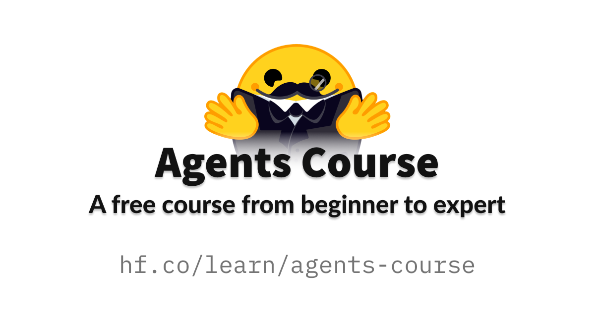
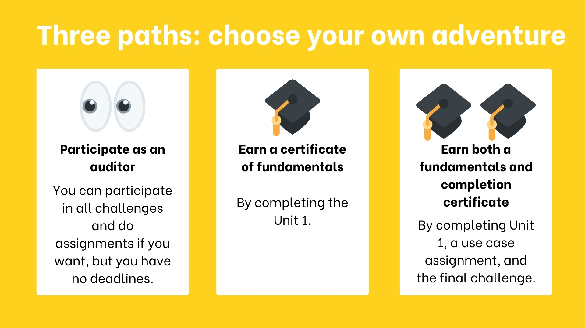
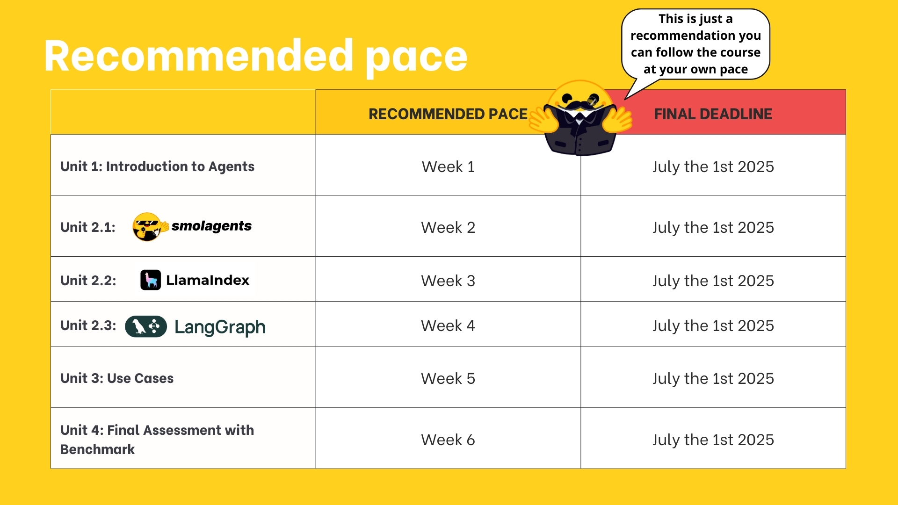

# HuggingFace_Agent_Fundamentals
This is the repository to document the learnings of the HuggingFace AI Agent Fundamentals Course.

In this course, the attenndees will learn the fundamentals of AI Agents in **theory**, **design** and **practice**. The students will learn how to  use established AI Agent libraries and frameworks such as **smolagents**, **LangChain** and **LlamaIndex**. For this the students will participate in challenges where they will evaluate the agents against other students. Further, the y will earn two certificates, one for the fundamentals and one for the completion of the course. 


# 🤗 Hugging Face Agents Course




## Course Syllabus

| Chapter | Topic                                          | Description                                                                                              |
|---------|------------------------------------------------|----------------------------------------------------------------------------------------------------------|
| 0       | Onboarding                                     | Set you up with the tools and platforms that you will use.                                               |
| 1       | Agent Fundamentals                             | Explain Tools, Thoughts, Actions, Observations, and their formats. Explain LLMs, messages, special tokens and chat templates. Show a simple use case using python functions as tools. |
| 1.5     | Bonus : Fine-tuning an LLM for function calling| Let’s use LoRa and fine-tune a model to perform function calling inside a notebook.                      |
| 2       | Frameworks                                     | Understand how the fundamentals are implemented in popular libraries : smolagents, LangGraph, LLamaIndex |
| 2.5     | Bonus : Agent Observability and Evaluation     | Learn how to trace and evaluate your AI agents to make them ready for production.                        |
| 3       | Use Cases                                      | Let’s build some real life use cases (open to PRs 🤗 from experienced Agent builders)                     |
| 4       | Final Assignment                               | Build an agent for a selected benchmark and prove your understanding of Agents on the student leaderboard 🚀 |

In addition to the course units there are three bonus units:

- Bonus Unit 1: Fine-tunning an LLM for Funnction-calling
- Bonus Unit 2: Agent Observability and Evaluation
- Bonus Unit 3: Agents in Games with Pokemon (learnning an Agent to play Pokemon battles)

## Prerequisites
- Basic Python knowledge
- Basic knowledge of LLMs

## Tools and accesses needed

- Discord
- Higging Face Account
- Ollama with model: **qwen2:7b**
- VSCode
- Conda or other environment to run Python Packages

## Certification Process



1. Certifications for fundamentals: Complete Unit 1 of the course
2. Certificate of completion: Complete Unit 1, one of the use case assignments proposed in the course, and the final challenge

**⏱️ Deadline: 1st of July 2025**

## Recommendations & Hints

Each chapter in this course is designed to be completed in 1 week, with approximately 3-4 hours of work per week.



## How to get the most out of the course?

1. Join study groups in Discord: studying in groups is always easier. To do that, you need to join our discord server and verify your Hugging Face account.
2. Do the quizzes and assignments: the best way to learn is through hands-on practice and self-assessment.
3. Define a schedule to stay in sync: you can use our recommended pace schedule below or create yours.

## 0. ⛵ Onboarding

### 1. Runnning a Model locally

First install the required model:


   ```bash 
   ollama pull qwen2:7b #Check out ollama website for more models
   ```


then try to start it:

   ```bash
   ollama serve
   ```

      If you run into the error “listen tcp 127.0.0.1:11434: bind: address already in use”, you can use command sudo lsof -i :11434 to identify the process ID (PID) that is currently using this port. If the process is ollama, it is likely that the installation script above has started ollama service, so you can skip this command to start Ollama.

Dont forget to install the necessary dependencies:

      To use LiteLLMModel module in smolagents, you may run pip command to install the module.

   ```bash
   pip install 'smolagents[litellm]'
   ```

After installing the model and dependecies in your python env, run the following code in the [onboarding.ipynb](units/0_Onboarding.ipynb) notebook:

   ```python
   from smolagents import LiteLLMModel
   
   model = LiteLLMModel(
       model_id="ollama_chat/qwen2:7b",  # Or try other Ollama-supported models
       api_base="http://127.0.0.1:11434",  # Default Ollama local server
       num_ctx=8192,
   )
   ```


Why this works?

   - Ollama serves models locally using an OpenAI-compatible API at http://localhost:11434.
   - LiteLLMModel is built to communicate with any model that supports the OpenAI chat/completion API format.
   - This means you can simply swap out InferenceClientModel for LiteLLMModel no other code changes required. It’s a seamless, plug-and-play solution.


Congratulations! 🎉 You’ve completed the onboarding process! You’re now ready to start learning about AI Agents. Have fun!